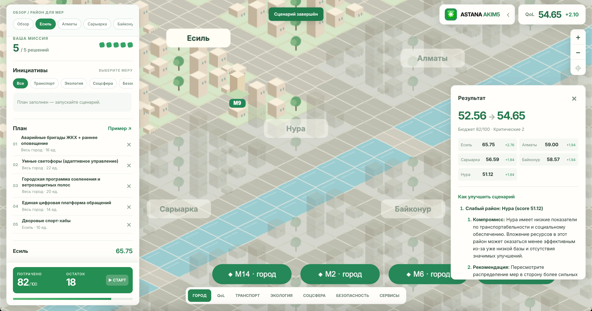

# Аким на 5 часов — SKYNOMADS



## Что решает

Симулятор городских решений: распределите ограниченный бюджет между инициативами для условных районов Астаны, получите рассчитанный Astana Quality of Life Score и объяснение компромиссов от AI.

## Что реализовано

- Общие для всех пользователей бюджет 100 и синтетические показатели пяти районов, 14 мероприятий.
- Выбор ровно пяти мер, проверка районов, повторов, ограничений по направлениям, несовместимостей и бюджета.
- Детерминированный расчёт показателей и Score по `docs/data-set.json`: лаги, синергии, слабейший район и штраф за значения ниже 40.
- Серверный вызов OpenAI для рекомендаций по улучшению рассчитанного сценария. AI опирается на показатели модели и не прогнозирует Score альтернатив. Если ключа нет или API недоступен, Score остаётся доступен, а ошибка AI показана явно.
- Изометрический прототип: полноэкранная PixiJS-карта с плотной застройкой, панель с активным районом сверху и добавлением мер одним кликом, слои показателей и закреплённый чекаут с остатком бюджета. По умолчанию виден весь цветной город; при выборе района остальные приглушаются, а кнопка «Показать весь город» сбрасывает выделение и камеру. Q1–Q8 запускается сразу при отправке сценария: машины движутся, районные стройки становятся готовыми после указанного в каталоге лага, городские меры подсвечивают районы. Итоговые числа появляются после таймлайна и ответа сервера; поквартальные показатели не моделируются.

## Архитектура

React SPA (`apps/frontend/`) запрашивает каталог через `GET /api/simulator` и отправляет `{ "decisions": [{ "measureId": "M7", "district": "Нура" }, …] }` в `POST /api/simulator`. Express (`apps/backend/`) валидирует набор, берёт цены и эффекты из датасета, рассчитывает числа на сервере и только после этого передаёт результаты в OpenAI Responses API. LLM не рассчитывает Score. Данные читаются из `docs/data-set.json` при запуске backend из его workspace; менять рабочий каталог для прямого запуска `server.js` нельзя без адаптации пути. Никакого пользовательского хранилища для сценариев нет.

## Технологии

React 19 + TypeScript + Webpack 5 — интерфейс; PixiJS v8 / WebGL — изометрическая карта; Express 5 + TypeScript — API и расчёт; OpenAI Responses API (`gpt-4o-mini`) — текстовое объяснение; Yarn Classic workspaces — зависимости и запуск.

## Требования

Node.js 22+, Yarn Classic 1.x, доступ к OpenAI API и действующий ключ для демонстрации AI. Для расчёта Score ключ не требуется.

## Быстрый запуск

```bash
git clone <URL_репозитория>
cd hack-30aab437-skynomads
yarn install --frozen-lockfile
```

Скопируйте `apps/backend/.env.example` в `apps/backend/.env` или в корневой `.env` и замените `OPENAI_API_KEY` на собственный ключ. Backend читает оба файла (при совпадении переменных приоритет у `apps/backend/.env`). Затем из корня:

```bash
yarn start
```

Откройте `http://localhost:3000`; backend работает на `http://localhost:7001`. Webpack проксирует `/api` в Express. Остановить оба сервера — `Ctrl+C`.

### Docker Compose (HMR)

Из корня репозитория:

```bash
docker compose up -d --build dev
docker compose ps
```

Откройте `http://localhost:3000`. Исходники смонтированы с хоста в `/app`: изменения frontend подхватываются Webpack HMR, backend работает через `tsx watch`. Зависимости устанавливаются при первом запуске в отдельный Docker volume и остаются между перезапусками. Корневой `.env` (или `apps/backend/.env`) читается backend прямо из bind mount, ключ не включается в Docker image.

Проверки внутри уже работающего контейнера:

```bash
docker compose exec dev yarn typecheck
docker compose exec dev yarn workspace @react-app/backend test
docker compose exec dev yarn build
```

Логи: `docker compose logs -f dev`; остановка: `docker compose down`. Не запускайте одновременно с локальным `yarn start`: оба используют порты 3000 и 7001.

## Конфигурация

| Переменная (`apps/backend/.env` или корневой `.env`) | Назначение | Пример в `.env.example` |
| --- | --- | --- |
| `OPENAI_API_KEY` | Реальный вызов AI; без неё Score считается, AI возвращает явную ошибку | `replace-with-your-openai-api-key` |
| `PORT` | Порт backend | `7001` |
| `NODE_ENV` | Режим backend | `development` |
| `JWT_SECRET` | Только демонстрационные auth-модули бойлерплейта; симулятор не использует | `replace-with-a-local-random-secret` |

`.env` игнорируется Git. Не публикуйте реальные ключи. Дополнительные переменные для шаблонных auth/blog/media модулей описаны в `apps/backend/README.md`.

## Проверка основного сценария

1. Откройте страницу, нажмите **«Пример ↗»** в плавающей панели слева. Выбраны M7/Нура, M8/Нура, M10/Нура, M12/весь город, M5/Сарыарка. Вручную: выберите район в верхнем pill или на карте, затем нажимайте на карточки мер. Общегородские меры добавляются без выбора района.
2. Нажмите **«▶ СТАРТ»** в чекауте с остатком бюджета. После визуального таймлайна Q1–Q8 появятся стоимость 95, остаток 5, исходный Score 52.56 и новый Score **56.54** (до округления 56.5431), срабатывает синергия M10 + M12.
3. При корректном `OPENAI_API_KEY` дождитесь рекомендаций AI по улучшению следующего варианта сценария. Без него интерфейс покажет сообщение об отсутствии конфигурации рядом с рассчитанными числами.
4. Удалите меру кнопкой «×» и добавьте другую: результат сбросится; Score изменится после нового расчёта. Повтор выбранной меры и превышение бюджета блокируются интерфейсом; сервер также отклоняет невалидные наборы.

Проверки кода:

```bash
yarn workspace @react-app/backend test
yarn typecheck
yarn build
```

## Ограничения

Датасет синтетический; цифры не являются прогнозом для реальной Астаны. Из опциональных функций PRD (сравнение команд, события, презентации) ничего не реализовано. Шаблонные auth/blog/media модули остаются частью бойлерплейта, но не участвуют в симуляции. В этом репозитории локальный запуск проверен; для отдельного деплоя backend нужно обеспечить доступ к `docs/data-set.json` (при отдельном Vercel-проекте этот путь не входит в его папку). Реальный ответ OpenAI необходимо проверить с собственным ключом.
