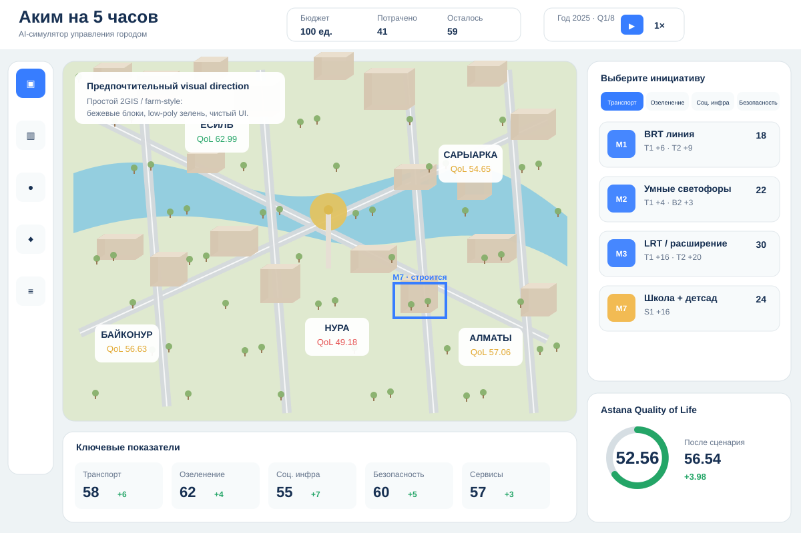
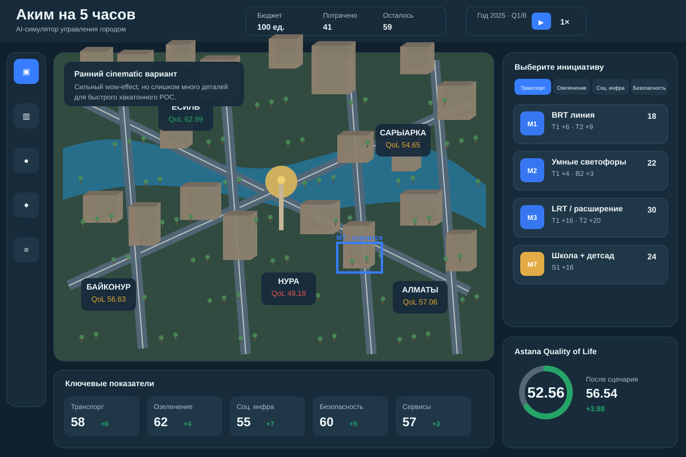

# Vision — «Аким на 5 часов»

## Коротко

**«Аким на 5 часов» — AI Urban Decision Sandbox.**

Внешне продукт выглядит как простая изометрическая city-management game в духе SimCity/фермы/2GIS 3D: город из лаконичных бежевых блоков, дороги, река, парки, транспорт, стройки и условные жители.

Внутри — детерминированная модель из `docs/data-set.json`.

AI не рассчитывает Score и не придумывает цифры. Он получает уже рассчитанный результат и объясняет последствия, компромиссы и риски.

> **SimCity снаружи. Deterministic simulation внутри. AI analyst сверху.**

## Visual references

### Preferred: simple isometric / 2GIS / farm style

Это основной reference для реализации: бежевые block-buildings, low-poly greenery, минимум текстур и максимум читаемости.

### Early direction: detailed cinematic

Этот вариант оставлен как reference для wow-effect, но **не является целевой детализацией**: для POC он визуально перегружен и дороже в реализации.

## Почему это сильнее обычного dashboard

Обычный dashboard показывает числа после выбора карточек.

Наша концепция показывает **город, который реагирует на решения**:

- выбрали школу в Нуре → появляется стройка;
- прошло 3 квартала → объект введён;
- показатель школ растёт;
- меняется District Score;
- меняется Astana Quality of Life Score;
- AI объясняет, кому стало лучше и какие проблемы остались.

Это делает причинно-следственную связь визуально понятной жюри за несколько секунд.

## Основной wow-effect

Главная сцена — не графики, а **живой изометрический город**.

Пользователь:
1. исследует районы;
2. замечает слабые показатели;
3. выбирает 5 решений;
4. видит стройки и эффекты на карте;
5. запускает `SIMULATE 2 YEARS`;
6. наблюдает Q1 → Q8;
7. получает итоговый Score и AI-разбор.

## Trust model

Числа должны быть воспроизводимыми.

- Budget, effects, lags, synergies, incompatibilities и Score берутся из dataset.
- UI ничего не «дорисовывает» в числах.
- LLM не пересчитывает модель.
- Все визуальные жители/машины — **представление состояния модели**, а не заявление о реальной статистике Астаны.

## Что уже есть в main

На текущем `main` уже реализован рабочий MVP:

- React/TypeScript frontend;
- Express/TypeScript backend;
- deterministic validation и scoring;
- чтение `docs/data-set.json`;
- OpenAI Responses API для объяснения рассчитанного результата;
- базовый end-to-end сценарий.

Эта ветка не заменяет существующее ядро. Она описывает **альтернативный game-like UX поверх существующего simulation core**.

## Product positioning

Рабочее позиционирование:

> **Не dashboard, который показывает цифры. Город, который реагирует на ваши решения.**

Технический subtitle:

> **AI-powered urban decision sandbox**

## Non-goals для хакатона

Мы не строим:

- настоящий digital twin Астаны;
- реальную транспортную модель уровня MATSim;
- GIS с точной геометрией;
- миллион полноценных AI-агентов;
- прогноз реальной демографии;
- real-time multiplayer на миллион concurrent users.

Это POC интерфейса принятия решений на синтетических данных.
